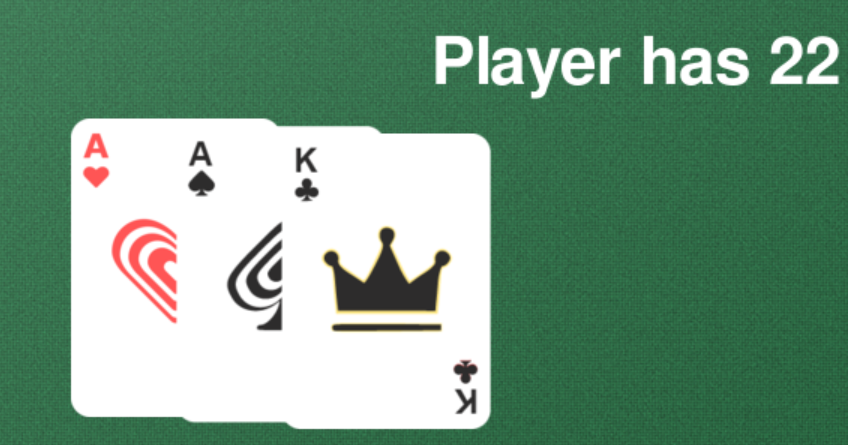

Totaal: 
Tutorial: 2u
Updating: 17u

# 22/02

Het eerste halfuur van de tutorial zit erop. Het werkt zoals het moet werken tot nu toe.

# 27/02

De blackjack-game-tutorial is af. Er zitten nog enkele bugs in, die zijn voor morgen. 
* als ik een nieuw spel begin, staat de dealer op reveal.
* controleer de scores

# 28/02 (3u)
## 8.30
Tijd voor eigen werk. Ik bedenk eerst graag wat ik wil doen, om dan uit te vogelen hoe ik het doe. 
Ik wil vooral mooiere kaarten > https://www.youtube.com/watch?v=rHEnZfq_zEQ 

## 9.30
Jack, Queen en King hebben nu een mooie kaart.
Het ziet er nog altijd allemaal heel 'paint' uit. Voor tkinter bestaat ttk om het mooier te maken.
Ik kom uit op PySimpleGUI, waar tkinter inzit. https://realpython.com/pysimplegui-python/ 
Blijkbaar is het wel moeilijk om die te combineren, dus ik ga toch maar gewoon prutsen in pygame. 

## 10.45
Het ziet er al beter (of toch anders) uit. Het is helaas nog niet duidelijk wanneer je en knop kan indrukken en wanneer niet. 

## 11.30
Genoeg gewerkt voor nu. 
* Ik heb kaarten met J,Q,K
* Ik heb een geluidje bij 'hit me' en 'succes'
* Ik heb de lay-out wat aangepast.

Ideetjes voor later:
* Kaarten met 4 kaartsoorten
* meer geluidjes
* transformeffectje

# 01/03 (0u30)
## 13.15
Ik heb de vier symbolen toegevoegd op de kaarten via een lettertype. 
Dit was maar een halfuurtje werk, minder dan verwacht. 
Volgende keer ga ik proberen om de kaarten ook zichtbaar uit te delen, dus via transform. 

# 03/03 (3u)
## 19.30
Ik wil graag dat de kaarten 'binnenvliegen'. https://www.youtube.com/watch?v=DWRjdrGaADg 
Dit was het niet.. 
https://www.youtube.com/watch?v=sfniTyS9yHo 

## 21.00
Het was toch anders dan in het filmpje, omdat ik het niet met een key deed. 
Met de hulp van Lumo is het toch gelukt. 
Je scherm 60 keer per seconde wordt gerefresht, dus worden je kaarten steeds opnieuw getekend. 
Je moet ze dus telkens een beetje hoger tekenen tot ze staan waar je ze wil (target).

De keys vind ik wel interessant, dus ga ik het spel speelbaar maken zonder muis:
- H(it)
- S(tand)
- Enter (deal)

## 21.30
Het is gelukt, maar nu heb ik dubbele code. Volgende stap: code opruimen. 
Ik heb al regelmatig met klassen gewerkt, maar ik snap er het fijne nog niet van. Daarom kies ik om dit te oefenen.
Ik zal beginnen met een klasse Card, omdat ik daarvan de logica snap. Je maakt een 'blauwdruk' van kaart en kan die telkens opnieuw oproepen.
Als je dan de kaart breder of hoger wil maken, kan dit op één plaats.
Met Card(//) kan je dan een kaart tekenen

## 22.30
De class Card is gelukt. 
Volgende keer:
- class Button maken (zodat ze er ook altijd hetzelfde kunnen uitzien)

# 04/03 (1u30)
## 19.45
## 20.15
Ik heb een class Buttons gemaakt. Ik zoek nu om de scores extern op te slaan. 
probleem: alles refresht voortdurend, maar het lijkt me heftig om 60x/s op te slaan. 
Dus het mag enkel opslaan als het spel gedaan is en de score verandert. 

## 21.15
De scores worden extern opgeslagen en opgehaald. Als je op reset klikt, komen deze weer op 0 te staan. 
Hier moet evt. nog een waarschuwing bij.

# 05/03 (0u30)
## 22.45
Net een halfuurtje gezorgd dat er een waarschuwing komt als je reset. Maar lelijklelijklelijk. 
Er moet echt nog iets aan de schoonheid van de app gebeuren. 

# 06/03 (1u30)
## 8.30
Ik zou alle kaarten kunnen vervangen door png's. De vraag is of dit mijn spel niet enorm traag zal maken.
Let's try anyway. 

## 10.00
Mijn kaarten verschijnen, maar veel te groot en niet smooth. Bedankt aan StackOverflow en lumo, want dit was niet gemakkelijk. Ik begrijp wel de code, en kan ze gebruiken.
In de Challenges stond iets van ImageMagick, mss toch eens installeren. 

Hoe gemakkelijk was dit!? Heerlijk. 
Ik moet nog een kaart voorzien voor de ??? want die heb ik even uitgezet
Nu past de rest er niet meer bij, dus dat gaan we ook oplossen. 

## 14.00
De ???-kaart is voorzien, maar niet echt foolproof of proper opgelost.
Ik moet zeker nog mijn spel voorzien voor fouten.

# 07/03 (4u)
## 12.00
Kleuren kiezen doe ik zelf het liefst met Coolor.(Tip voor een Challenge?) 
Ik heb ook feedback gevraagd:
    Ben jij onder of boven? 
    Het is niet duidelijk wanneer je wint. 

## 12.30
Nieuwe achtergrond, nieuwe problemen
    reset = pygame.draw.rect(screen, "color_grey", [540,840,30,30], 0, 0)
    reset_img = pygame.image.load("Project/Media/reset.png")
    screen.blit(reset_img, (540, 840))

## 14.15
Alles ziet er al een stuk beter uit.
Mijn infobuttons zijn hetzelfde als mijn drukbuttons. Dat is nog een probleem. 

## 17.15
Ik heb mijn hoover aangepast, maar visueel wil ik ook iets veranderen. 

Oei, A + A + K = 22, maar dit zou 12 moeten zijn.

Player wins komt al voor kaarten gedeeld zijn, dat is vervelend. 

## 17.45
Het spel werkt, het spel ziet er goed uit. 
Tijd om ook de code op te ruimen en van comments te voorzien.

# 08/03 (1u)
## 12.30
Het is zeer verwarrend met de knoppen, ik denk dat je beter met namen werkt

## 13.30
Ik ben het spel aan het opschonen met extra functies. 
Nu kloppen mijn buttons niet meer, maar dat is voor de volgende keer. 

# 10/03 (2u)
## 21.00
Ik heb wat geprutst met het geluid en de komst van het kader dat zegt of je wint. Het kwam te snel vond ik.
Nu is er echter een probleem als de speler meteen wint. Er is een probleem als de kaarten nog niet uitgemoved zijn.
Ik heb het opgelost met nog een variabele. Dat vind ik nog niet zo proper. Ik zit vast met die reset_game(). 

## 22.00

Ik heb nog geprobeerd om een klasse Game of Score te maken, maar dat lukt me momenteel niet. Ik zie niet goed in wat bij de __init__ moet.
Ik denk al die variabelen van reset, want dat zijn de kenmerken van de game. Als deze veranderen, verandert er iets in de game.
Ik waag in mijn overige 3u wellicht nog een nieuwe poging, maar vanavond niet meer.

